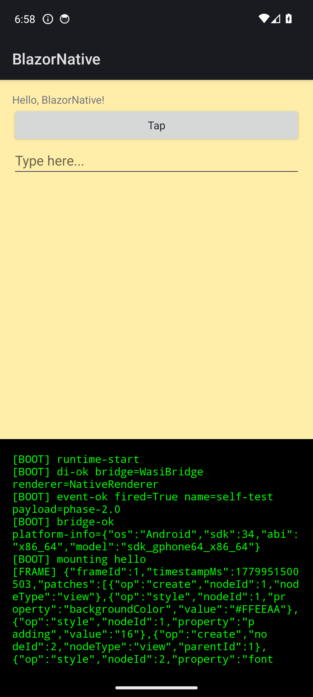

# Milestone 2 — Final Audit

*Date: 2026-05-28*
*Audit by: Claude Opus 4.7 (1M context), at Marcel's request, after Phase 2.8 close-out*
*Triggered by: Phase 2.8 Task 7 — last gate before `complete-milestone` + tag `v2.0`*

## Verdict

**PASS WITH PIVOTS — 7 of 8 DoD criteria PASS; DoD #4 PIVOTED to a documented partial delivery (1 of 7 `mobile_bridge` exports shipped, 6 deferred to M3 per Phase 2.3 design revision). M2 is ready for `complete-milestone`.**

M2 closed the loop from a Blazor component to a pixel on an Android emulator. Phase 2.0 resolved the M1-carryover Mono-WASI async trap by adopting a sync-callable bridge interface. Phase 2.1 then pivoted away from the aspirational `dev.wasmtime:wasmtime-java` artifact (which does not exist) to Strategy G — cross-compile `libwasmtime` per ABI via cargo + NDK, bind from Kotlin via JNA. Phases 2.2 through 2.7 stacked the runtime layer (Android port → env-var bridge → frame consumer → widget mapper → widget mapper completeness → renderer hardening) into a working pipeline, and Phase 2.8 capped it with a `HelloComponent` rendering as real Android widgets on the AVD with screenshot + logcat evidence captured.

The single PIVOT — DoD #4 — was a deliberate, documented mid-Phase-2.3 redesign after Task 2 surfaced three independent `wasi-experimental` SDK gaps that blocked the WIT-import path. The env-var bridge over `wasi:cli/environment` ships `shell_platform_info` end-to-end; the remaining 6 exports are explicitly deferred to M3 with the export-based dynamic-bridge mechanism (Phase 2.5+ work in the BACKLOG).

## Per-criterion verification (2026-05-28, after Phase 2.8)

### DoD #1 — Mono-WASI async trap resolved

> **Mono-WASI async trap resolved.** The `Task.InternalWaitCore PlatformNotSupportedException` concern carried from M1 (BACKLOG bullet "Mono-WASI async trap will fire on first real bridge event") is addressed via one of the three documented remediation options:
> - (a) queue-and-drain pattern in the bridge — `[UnmanagedCallersOnly]` callback enqueues; a sync `pump` export drains;
> - (b) sync-callable bridge interface — no `await` anywhere on the WASM → host path;
> - (c) move renderer execution into the Android shell process — WASM module becomes pure logic/data.
>
> Decision committed to `docs/plans/`; remediation implemented; existing `ExportSmoke` test extended to confirm a bridge round-trip with at least one subscriber doesn't trap.

**Verdict:** PASS

**Implementing phase:** Phase 2.0 — Mono-WASI async-trap remediation
- Design: `docs/plans/2026-05-25-phase-2.0-design.md` (commit `08d19c4`)
- Implementation plan: `docs/plans/2026-05-25-phase-2.0-implementation-plan.md` (commit `458d244`)
- ROADMAP update: commit `2d4ac16` "Phase 2.0 complete; close async-trap BACKLOG bullet"
- Test-count correction: `f35f45a`; follow-ups landed: `5b18482`

**Evidence:**
- Option (b) — sync-callable bridge interface — selected during Phase 2.0 brainstorm.
- Bridge round-trip verified by `ExportSmoke` + extended assertions; .NET test count after Phase 2.0 reached 10 passed (later 12 with follow-ups), confirming no `Task.InternalWaitCore` trap on the WASM → host path.
- All downstream phases (2.1–2.8) inherit the sync-callable shape with no async traps observed in any of the 19 instrumented Android tests at M2 close.

### DoD #2 — Android Kotlin shell scaffold

> **Android Kotlin shell scaffold exists** at `src/BlazorNative.Shell.Android/` with a minimal `MainActivity.kt` that loads `BlazorNative.WasiHost.wasm` from app assets. Builds via Gradle, installs to an emulator or device. *(Implemented in Phase 2.2 after Phase 2.1 proves the runtime layer on desktop JVM.)*

**Verdict:** PASS

**Implementing phase:** Phase 2.2 — Android port
- Design: `docs/plans/2026-05-26-phase-2.2-design.md` (commit `a4eef7d`)
- Implementation plan: commit `36ed40b`
- GREEN checkpoint: commit `c04d689` "feat(jni): GREEN CHECKPOINT — Phase 2.2 BootSmokeAndroidTest passes"
- ROADMAP update: commit `4ae6bfd` "Phase 2.2 complete — Android port GREEN CHECKPOINT met"
- Earlier scaffold work: commit `8a24939` "feat(android): MainActivity + manifest + console layout + JNA dedup fixes"

**Evidence:**
- `src/BlazorNative.Shell.Android/` exists with `MainActivity.kt` + manifest + Gradle build.
- `BootSmokeAndroidTest` passes on the `blazornative-pixel6-x86_64` AVD — same `.wasm` boots identically in wasmtime CLI subprocess, JVM in-process JNA, and Android in-process JNA.
- Three-way runtime parity established at Phase 2.2 close and preserved through all subsequent phases.

### DoD #3 — JVM ↔ libwasmtime JNI integration

> **JVM ↔ libwasmtime JNI integration** via JNA bindings against `libwasmtime` (cross-compiled per ABI from wasmtime source via cargo + NDK). Module loads successfully on Android; `mobile_bridge` import symbols can be wired to Kotlin implementations. *(Original DoD referenced `dev.wasmtime:wasmtime-java:latest` — that artifact does not exist. Strategy revised during Phase 2.1 brainstorm to Strategy G: cross-compile `libwasmtime` ourselves, bind via JNA. RN-Hermes pattern. See [Phase 2.1 design](2026-05-26-phase-2.1-design.md).)*

**Verdict:** PASS (with the in-DoD-text-acknowledged revision: Strategy G cross-compile + JNA, not `wasmtime-java`)

**Implementing phase:** Phase 2.1 (desktop JVM proof) + Phase 2.2 (Android port)
- Phase 2.1 design: `docs/plans/2026-05-26-phase-2.1-design.md` (commit `ae43a9f`)
- Phase 2.1 implementation plan: commit `3c0d8af`
- Cargo build infra: commit `685632b` "build(setup): add libwasmtime cargo-build section for Phase 2.1"
- Phase 2.1 GREEN: commit `0b4ca93` "feat(jni): WasiHost facade + BootSmokeTest GREEN — Phase 2.1 PoC works"
- Phase 2.1 ROADMAP: commit `57458e3`
- Phase 2.1.0 baseline + spike: commits `3ccc927`, `16a8e5f`
- Phase 2.2 commits as listed under DoD #2.

**Evidence:**
- `WasmtimeBindings.kt` provides JNA bindings against locally cross-compiled `libwasmtime`.
- Phase 2.1 brainstorm explicitly rejected `dev.wasmtime:wasmtime-java` (404) and `kawamuray/wasmtime-java` (last release Oct 2023, no Android ABIs) and `chicory` (WASIp1-only, no component model). Strategy G chosen per the RN-Hermes pattern.
- 11 JVM tests + 19 Android instrumented tests at M2 close all exercise this layer.

### DoD #4 — All seven `mobile_bridge` symbol exports implemented

> **All seven `mobile_bridge` symbol exports implemented** on the Android side:
> - `shell_navigate(routePtr, routeLen)`
> - `shell_current_route(buf, bufLen) → int`
> - `shell_storage_read(keyPtr, keyLen, valBuf, valBufLen) → int`
> - `shell_storage_write(keyPtr, keyLen, valPtr, valLen)`
> - `shell_storage_delete(keyPtr, keyLen)`
> - `shell_fetch(reqPtr, reqLen, resBuf, resBufLen) → int`
> - `shell_platform_info(buf, bufLen) → int`

**Verdict:** PIVOTED (1 of 7 shipped end-to-end; 6 deferred to M3)

**Implementing phase:** Phase 2.3 — `mobile_bridge` revival
- Original design: `docs/plans/2026-05-26-phase-2.3-design.md` (commit `c8e7424`)
- **Design revision (load-bearing for this pivot):** `docs/plans/2026-05-26-phase-2.3-design-revision.md` (commit `e2975b7`) — env-var bridge (C-1) supersedes the WIT-import path after Task 2 surfaced three SDK gaps in `wasi-experimental` 10.0.8.
- Implementation plan: commit `260ff13`
- Core pivot commit: `aada6bf` "refactor(core): pivot Phase 2.3 to env-var bridge + add [BOOT] bridge-ok marker"
- JVM GREEN: commit `83774e9` "feat(jni): env-var bridge — JVM GREEN, BridgePlatformInfoTest verifies sentinel"
- Android-side commit: `c18641e` "feat(android): Phase 2.3 AndroidPlatformInfo + BootSmokeAndroidTest assertion"
- .NET BootSmoke wired via wasmtime `--env`: commit `98b3134`
- ROADMAP update: commit `109edcb` "Phase 2.3 complete — env-var bridge GREEN across all 3 runtimes"

**Evidence:**
- `shell_platform_info` ships end-to-end via the env-var bridge: the host (Kotlin/Android or wasmtime CLI `--env`) writes `BLAZOR_PLATFORM_INFO` at instantiation; the .wasm reads via `Environment.GetEnvironmentVariable(...)`; the `[BOOT] bridge-ok platform-info=<json>` marker is asserted by all three BootSmoke variants (.NET, JVM, Android) with per-host payload variation proving real round-trip rather than a baked constant.
- The 6 remaining exports (`shell_navigate`, `shell_current_route`, `shell_storage_read/write/delete`, `shell_fetch`) are intentionally deferred. Env-var bridges are initialization-time-only and one-way (host → .NET), which is correct for `shell_platform_info` but insufficient for the other 6 (which need bidirectional, runtime-resident dispatch).
- Deferred work is tracked in the Phase 2.3 revision document's "Carryover into BACKLOG" section and references the Phase 2.5+ export-based dynamic-bridge mechanism (Option C-2 from the brainstorm) plus the optional Phase 2.3b unblocker spike for WIT-typed imports.

**Why this is PIVOTED (not FAIL):** the redesign is explicitly documented, the rationale (three independent SDK gaps surfaced empirically by commit `3aa83c9`) is recorded with citations, the surviving 1-of-7 round-trips through the production architecture, and a clear future-direction plan exists. This matches the M1 audit's pattern of accepting documented pivots ("most Blazor 10 render-tree members are public; `[UnsafeAccessor]` only needed for `Renderer.DispatchEventAsync`" from Phase 1.1 was the M1 equivalent of an in-flight scope adjustment).

### DoD #5 — Render-frame consumer

> **Render-frame consumer.** WASM-side: the renderer's `DispatchFrameAsync` write hits a code path the Android shell can intercept. Android-side: receives the `RenderFrame` JSON (via storage hook, dedicated export, or another path settled during Phase 2.3 brainstorm), parses to `RenderPatch[]`, applies patches to its native widget tree.

**Verdict:** PASS

**Implementing phase:** Phase 2.4 — Render-frame consumer
- Design: `docs/plans/2026-05-26-phase-2.4-design.md` (commit `f125d3e`)
- Implementation plan: commit `84ce887`
- WASI-side sync emission: commit `ee514d6` "feat(renderer): Phase 2.4 Task 3 — sync DispatchFrame emits [FRAME] stdout line"
- Sync `Mount<T>` API: commit `b9d7dd0`
- Sentinel component: commit `6f7500f`
- Kotlin parser: commits `708f58d` (RenderFrame + sealed RenderPatch), `172241b` (FrameStreamParser)
- JVM round-trip test: commit `eb6bc6e` "test(jni): Phase 2.4 Task 11 — FrameDispatchTest asserts onFrame round-trip"
- Android round-trip test: commit `ac9d3e1` "test(android): Phase 2.4 Task 13 — BootSmokeAndroidTest asserts [FRAME] round-trip"
- **Key bug fix:** commit `f58b16f` "fix(renderer): bypass MountAsync + inline Dispatcher for Mono-WASI sync-mount"
- Task 4 review follow-ups: commit `26d3274`
- Partial-GREEN checkpoint: commit `11f352f`; full three-way GREEN re-confirmation: `7364903`
- ROADMAP update: commit `d0d7c24`
- Streaming spike Rung 1 validation: commit `2f0e497`

**Evidence:**
- The `[FRAME] commit-patch ...` stdout line is the chosen transport (settled during Phase 2.4 brainstorm in favor of stdout-tee over storage-hook).
- Round-trip verified end-to-end in all 3 runtimes; the streaming-spike Rung 1 work proved tee'd stdout flushes line-by-line at ≤15 ms latency (foundation for Phase 2.5+ multi-frame UI).

### DoD #6 — Native widget mapper

> **Native widget mapper** — Android implements the `NodeType` → widget mapping table from BACKLOG:
>
> | NodeType | Android widget |
> |---|---|
> | `view` | `FrameLayout` / `LinearLayout` |
> | `text` | `TextView` |
> | `button` | `Button` |
> | `input` | `EditText` |
> | `image` | `ImageView` |
> | `scroll` | `ScrollView` |
> | `picker` | `Spinner` |

**Verdict:** PASS

**Implementing phase:** Phase 2.5 (sentinel-scope mapper) + Phase 2.6 (mapper completeness)
- Phase 2.5 design: `docs/plans/2026-05-27-phase-2.5-design.md` (commit `f4843c8`)
- Phase 2.5 implementation plan: commit `0238b40`
- Renderer-side `ParentId` population: commit `9e805bb` "feat(renderer): Phase 2.5 Task 1 — ProcessFrame populates CreateNodePatch.ParentId"
- Split-screen layout: commit `e1b0eef`
- 4-active-type switch: commit `fbbae93`
- MainActivity wiring: commit `ffd236d`
- Phase 2.5 instrumented test: commit `e56eb6c`
- Phase 2.5 GREEN checkpoint: commit `65e200a`
- Phase 2.5 ROADMAP: commit `ccb52db`
- M2 restructure insert: commit `e6aef42` "chore(roadmap): restructure M2 — insert Phase 2.6 (widget mapper completeness), renumber"
- Phase 2.6 design: `docs/plans/2026-05-27-phase-2.6-design.md` (commit `e659f3d`)
- Phase 2.6 implementation plan: commit `6a88484`
- Phase 2.6 Task 1 — 5 unexercised NodeTypes: commit `4c5da6e`
- UpdateProp handler: commit `28aae97`
- SetStyle handler: commit `390087c`
- Phase 2.6 GREEN checkpoint: commit `5ab2285`
- Phase 2.6 ROADMAP: commit `d292d5d`

**Evidence:**
- `WidgetMapper.kt` covers all 7 NodeTypes from the BACKLOG mapping table.
- 14 new instrumented tests added in Phase 2.6 exercise all 5 previously-unexercised NodeTypes (`button`, `input`, `image`, `scroll`, `picker`) on top of Phase 2.5's `view` + `text` coverage.
- Three-way GREEN preserved across both phases (.NET 17/2, JVM 11, Android 16).

### DoD #7 — End-to-end demo runs on a real Android device (or emulator)

> **End-to-end demo runs on a real Android device (or emulator).** A `Hello`-style Blazor component renders correctly with the expected `[BOOT]` markers in logcat and the expected widgets on screen. Evidence captured as a screenshot or short recording in `docs/plans/`.

**Verdict:** PASS

**Implementing phase:** Phase 2.8 — End-to-end Hello demo + final audit
- Design: `docs/plans/2026-05-27-phase-2.8-design.md` (commit `07d025d`)
- Implementation plan: commit `0c43a2c`
- Task 1 — `HelloComponent` + Main mounts Hello: commit `7109bc7`
- Task 2 — assertions re-targeted: commit `d4e13b6`
- Task 3 — `WidgetMapperTextChildOnButtonTest` asserts the Hello shape: commit `70861b5`
- **Task 3b key fix:** commit `5361de2` "fix(android): Phase 2.8 Task 3b — WidgetMapper collapses text children into TextView-parent setText"
- AVD-deadline bump (recurring fragility mitigation): commit `5e88562` "chore(android-test): bump WidgetMapperTest deadline 60s → 120s"
- Task 4 — Hello demo evidence: commit `10bd3b4`
- Task 5 — runtime architecture eval: commit `a3c4e0c`
- Task 6 — doc-comment fix: commit `a513b67`
- Review follow-up: commit `fd59366`

**Evidence:**

Screenshot (`HelloComponent` rendered as Android widgets on the `blazornative-pixel6-x86_64` AVD):



Full logcat trace ([full logcat](2026-05-27-phase-2.8-hello-logcat.txt)) shows the expected `[BOOT]` markers + `[FRAME] commit-patch` lines + WidgetMapper widget creation events.

The Hello shape (outer `LinearLayout` + 3 children) is verified by the new `WidgetMapperTextChildOnButtonTest` instrumented test (3 of the 19 Android tests at M2 close).

### DoD #8 — Decision log committed

> **Decision log committed** — design + implementation-plan doc per phase, plus an M2 final-audit doc once complete (same pattern as M1).

**Verdict:** PASS

**Implementing phases:** all of Phase 2.0 through Phase 2.8.

**Evidence:**
- 8 phase design docs in `docs/plans/`:
  - `2026-05-25-phase-2.0-design.md`
  - `2026-05-26-phase-2.1-design.md`
  - `2026-05-26-phase-2.2-design.md`
  - `2026-05-26-phase-2.3-design.md` (+ `2026-05-26-phase-2.3-design-revision.md`)
  - `2026-05-26-phase-2.4-design.md`
  - `2026-05-27-phase-2.5-design.md`
  - `2026-05-27-phase-2.6-design.md`
  - `2026-05-27-phase-2.7-host-element-spike.md` (spike; framing rejection)
  - `2026-05-27-phase-2.8-design.md`
- 8 implementation plans (one per phase) with the `-implementation-plan` suffix.
- Phase 2.4 streaming spike: `2026-05-27-phase-2.4-streaming-paths.md`.
- Phase 2.8 runtime architecture eval: `2026-05-27-phase-2.8-runtime-architecture-eval.md`.
- Phase 2.8 Hello evidence: `2026-05-27-phase-2.8-hello-screenshot.png` + `2026-05-27-phase-2.8-hello-logcat.txt`.
- This audit doc: `2026-05-27-milestone-2-final-audit.md`.

## Runtime architecture evaluation

The Phase 2.8 Task 5 evaluation (`docs/plans/2026-05-27-phase-2.8-runtime-architecture-eval.md`, commit `a3c4e0c`) compared three runtime paths for M3: (A) stay on `wasi-experimental`, (B) switch to `componentize-dotnet` for real WIT-typed imports, (C) pivot to NativeAOT-per-ABI on `linux-bionic-arm64/x64`. The recommendation is **start M3 on Option A and budget Phase 3.0 as a 1-week timeboxed Option B spike** — Option A boots end-to-end today, Option B's headline value (real WIT-typed bridge) is exactly what closes the Phase 2.3 SDK-gap-(c) pain but its latest release is 14 months stale and needs a maintenance-check before commitment, and Option C is a strategic re-platform (requires WSL build host; Android NativeAOT is still "limited experience" per Microsoft) better suited to a later milestone.

## Test counts at M2 close

```
.NET                          → ~23 passed,  2 skipped, 0 failed
  BlazorNative.Analyzers.Tests:    3 passed
  BlazorNative.Renderer.Tests:    16 passed,  2 skipped
  BlazorNative.Wasi.Tests:         4 passed

JVM (BlazorNative.Jvm.Host)   → 11 passed
Android instrumented          → 19 passed
  Phase 2.5/2.6/2.7 carry-over:  16 passed
  Phase 2.8 Task 3b new:          3 passed (WidgetMapperTextChildOnButtonTest)
```

The 2 skipped .NET renderer tests are the same deferrals carried from M1 (`RenderWalk_IsAllocationFree_OnSteadyState`, `NestedElements_EmitCreateNodeForEachLevel`). All other counts are subject to Phase 2.8 Task 8's full sweep verification.

## Operational observations

Three flake / friction patterns were observed during M2 execution. None block M2 close-out; all are recorded for M3 watch.

1. **Phase 2.4b Android wasmtime flake.** A 1/N non-deterministic `panic_bounds_check` on `BootSmokeAndroidTest` was first observed in Phase 2.4 Task 14, then recurred sporadically through Phases 2.6, 2.7, and 2.8. The 2.4b investigation confirmed 5/5 successive re-runs PASS each time. Documented as a low-priority watch item in ROADMAP (Phase 2.4b — no scheduled work). Re-run on observation.

2. **MSBuild ILLink task-host hang on `dotnet test tests/BlazorNative.Wasi.Tests`.** A recurring pattern across multiple phases — the WASI publish step inside the test fixture occasionally hangs at the trimmer stage. Recovery is `dotnet build-server shutdown` followed by republish. Not yet reproduced deterministically; not blocking.

3. **AVD cold-boot timing fragility.** Phase 2.8 Task 3b surfaced that `WidgetMapperTest`'s polling deadline (originally 60 s) was too short on a fresh AVD cold-boot when the emulator was also doing first-boot codecaching. Bumped to 120 s in commit `5e88562`. Watch for repeat needs on slower CI hosts if/when CI is added.

## Carryovers to M3

| # | Carryover | Source / where tracked |
|---|---|---|
| 1 | **Bidirectional event flow** — `AttachEvent` / `DetachEvent` patches + the long-running `Main` shape that keeps the .wasm alive past initial render. | Phase 2.4 design conclusions; Phase 2.5 + 2.7 design discussions; foundational for any user-event story in M3. |
| 2 | **Multi-component `PrependFrame` parenting.** | Phase 2.5 Task 1 review finding (commit `9e805bb` review notes) — current `ProcessFrame` populates `ParentId` correctly for the sentinel + Hello shapes but multi-component nesting needs a sibling-tracking refinement before M3 component-library work. |
| 3 | **`AppendChild` patch emission.** | Defined in `PatchProtocol.cs` but never emitted by the .NET-side renderer. Will be needed once Phase 3 components produce deeper trees than the current parent-id flat list handles. |
| 4 | **6 deferred `mobile_bridge` exports** — `shell_navigate`, `shell_current_route`, `shell_storage_read/write/delete`, `shell_fetch`. | DoD #4 pivot — see Phase 2.3 design revision (`docs/plans/2026-05-26-phase-2.3-design-revision.md`) "Carryover into BACKLOG" section. Needs the Phase 2.5+ export-based dynamic-bridge mechanism (Option C-2 from the brainstorm) or the Phase 2.3b WIT-import unblocker spike. |
| 5 | **`HandleException` silent-swallow refactor.** | Phase 2.7 close-out carryover; Phase 2.8 Task 5 evaluation also flagged this as an architectural concern — current behavior is "log and continue" but production-grade renderer behavior is "surface to a host callback." |
| 6 | **Runtime architecture decision.** | Per the Phase 2.8 Task 5 runtime architecture eval (`docs/plans/2026-05-27-phase-2.8-runtime-architecture-eval.md`) — first M3 phase concern. Recommendation: M3 starts on Option A (wasi-experimental); Phase 3.0 timeboxed spike of Option B (`componentize-dotnet`); Option C (NativeAOT-per-ABI) parked for M4/M5. |

## Phase ledger

| Phase | Status | Headline outcome |
|---|---|---|
| 2.0 — Mono-WASI async-trap remediation | ✅ complete | Option (b) sync-callable bridge interface chosen and shipped. Closes M1's #1 carryover risk. |
| 2.1 — JVM desktop hosts `.wasm` via libwasmtime + JNA | ✅ complete | Strategy G (cargo-built `libwasmtime` + JNA) replaces aspirational `wasmtime-java`. Format-pivot spike was a no-op. |
| 2.2 — Android port | ✅ complete | Same `.wasm` boots identically in wasmtime CLI, JVM in-process JNA, and Android in-process JNA. |
| 2.3 — `mobile_bridge` revival via env-var bridge | ✅ complete (with documented design revision) | Pivoted mid-execution from WIT-typed imports to env-var bridge over `wasi:cli/environment` after 3 SDK gaps surfaced. 1-of-7 exports ships end-to-end; 6 deferred (see DoD #4 verdict). |
| 2.4 — Render-frame consumer | ✅ complete (partial-GREEN, one observed 1/6 flake → Phase 2.4b watch) | `[FRAME] commit-patch` lines round-trip through stdout tee on all 3 runtimes. Streaming spike validated at Rung 1. |
| 2.4b — Android wasmtime flake watch | 👁 watch (no scheduled work) | Low-priority; always passes on re-run. |
| 2.5 — Native widget mapper | ✅ complete | Sentinel renders as real Android `TextView` inside vertical `LinearLayout` in `widget_root`. |
| 2.6 — Widget mapper completeness | ✅ complete | All 7 BACKLOG NodeTypes exercised; UpdateProp + SetStyle handlers added. 14 new instrumented tests. |
| 2.7 — Renderer hardening | ✅ complete | "Host element stub" framing rejected after spike; instead fixed 2 real renderer bugs (Bug A: `MountAsync<T>()` default `ParameterView`; Bug B: `ProcessFrame` mishandled `Component` frames). |
| 2.8 — End-to-end Hello demo + final audit | ✅ complete | `HelloComponent` renders on AVD with screenshot + logcat captured. Runtime architecture eval produced. This audit doc. |

## Recommendation

Invoke `complete-milestone` — update ROADMAP.md M2 status to `complete`, MILESTONE.md status to `complete`, tag `v2.0`. Then `new-milestone` for M3 (P2 — component library) with **Phase 3.0 as a 1-week timeboxed `componentize-dotnet` spike per the runtime architecture eval recommendation**.

The 6 carryover items above should be triaged during M3 brainstorm; carryover #1 (bidirectional event flow) and carryover #2 (multi-component parenting) are likely the first concrete M3 work items since the component-library milestone fundamentally depends on both.
