# Impact Analysis: Phase 13.0 — extract the item surface

## Summary

| Metric | Value |
|---|---|
| Date | 2026-08-19 |
| Refactor Type | **Architectural** (extract + change interface) |
| Targets | 14 components + 2 new base types + 2 baselines |
| Directly Affected Files | 18 |
| Transitively Affected Files | ~14 (tests + generated docs) |
| Total Affected Files | ~32 |
| Breaking Changes | 12 (all in `BlazorNative.Components`) |
| Risks Identified | 7 |
| Risk Level | **Medium** |

## What the mapping changed about the design

Two findings materially reshape Phase 13.0. Both were invisible from the issue, the
audit, and the milestone design; both came out of reading the render paths.

### Finding 1 — there are TWO mechanisms, not one

The milestone design assumed every component emits its own element and therefore needs
one shared emitter. It does not:

| Kind | Components | Mechanism |
|---|---|---|
| **Element emitters** (10) | `BnView`(div) · `BnImage`(img) · `BnScroll`(scroll) · `BnText`(span) · `BnButton`(button) · `BnCheckbox` · `BnPicker`(select) · `BnSlider` · `BnSwitch` · `BnModal` | `b.AddAttribute(seq, "name", value)` |
| **Wrappers** (2) | `BnFlexPreset` → renders a `BnView` · `BnList` → renders a `BnScroll` | `b.AddComponentParameter(seq, nameof(BnView.X), X)` |

`BnFlexPreset` is not a peer of `BnView` — it is a **forwarding shim** that renders one
and hands it 23 parameters by name. So the base must provide **two** helpers:

- `EmitItemAttributes(RenderTreeBuilder)` — for the 10 emitters
- `ForwardItemParameters(RenderTreeBuilder)` — for the 2 wrappers

**Without the second, the duplication only half-collapses**: `BnFlexPreset`'s 23-line
forwarding block survives the refactor untouched, and `BnList` never gains the surface at
all. The declaration would be de-duplicated while the *forwarding* stayed copy-pasted.

### Finding 2 — the surface is partial in two components, not absent

The audit said "absent from four". Measured, it is **absent from four and partial in two**:

| Component | Item params today |
|---|---|
| `BnText` · `BnButton` · `BnInput` · `BnActivityIndicator` | **0 of 17** |
| `BnList` | **`Width` only** |
| `BnModal` | **`BackgroundColor` only** |

This answers the milestone design's open question with evidence rather than preference.
`BnList` and `BnModal` should **not** be allowlisted exceptions — each already carries a
lone item parameter, which is the shape of a surface someone started and abandoned. And
`BnList` renders a `BnScroll`, so it is a *wrapper* and gains the surface by forwarding —
the mechanism Finding 1 requires anyway.

**Recommendation: the allowlist is empty.** Every component derives from `BnLayoutItem`.
The pin still needs an allowlist *mechanism* (so a future exception must be argued in
writing), but nothing goes on it today.

## Dependency Graph

```dot
digraph phase_13_0 {
  rankdir=TB; node [shape=box, style="rounded,filled", fontname="Helvetica"];

  subgraph cluster_new { label="NEW"; style=dashed;
    item      [label="BnLayoutItem\n17 params + 2 helpers", fillcolor="#cde6ff", penwidth=3];
    container [label="BnLayoutContainer\n+6 container params", fillcolor="#cde6ff", penwidth=3];
  }
  container -> item [label="extends"];

  subgraph cluster_emit { label="ELEMENT EMITTERS — use EmitItemAttributes()";
    view   [label="BnView (div)",     fillcolor="#ffb3b3"];
    image  [label="BnImage (img)",    fillcolor="#ffb3b3"];
    scroll [label="BnScroll (scroll)",fillcolor="#ffb3b3"];
    check  [label="BnCheckbox",       fillcolor="#ffb3b3"];
    picker [label="BnPicker (select)",fillcolor="#ffb3b3"];
    slider [label="BnSlider",         fillcolor="#ffb3b3"];
    swtch  [label="BnSwitch",         fillcolor="#ffb3b3"];
    text   [label="BnText (span)\nGAINS surface",   fillcolor="#ffd9b3"];
    button [label="BnButton (button)\nGAINS",       fillcolor="#ffd9b3"];
    input  [label="BnInput\nGAINS",                 fillcolor="#ffd9b3"];
    spin   [label="BnActivityIndicator\nGAINS",     fillcolor="#ffd9b3"];
    modal  [label="BnModal (modal)\nPARTIAL→full",  fillcolor="#ffd9b3"];
  }

  subgraph cluster_wrap { label="WRAPPERS — use ForwardItemParameters()";
    preset [label="BnFlexPreset\n→ renders BnView", fillcolor="#ffb3b3"];
    list   [label="BnList → renders BnScroll\nPARTIAL→full", fillcolor="#ffd9b3"];
  }
  preset -> view   [label="renders", style=dotted];
  list   -> scroll [label="renders", style=dotted];

  row [label="BnRow",    fillcolor="#ffe6b3"];
  col [label="BnColumn", fillcolor="#ffe6b3"];
  row -> preset [label="extends"]; col -> preset [label="extends"];

  container -> view; container -> preset;
  item -> image; item -> scroll; item -> check; item -> picker;
  item -> slider; item -> swtch; item -> text; item -> button;
  item -> input; item -> spin; item -> modal; item -> list;

  subgraph cluster_gate { label="GATES"; style=dashed;
    api  [label="PublicAPI.Shipped/Unshipped.txt\n~380 entries move", fillcolor="#ffb3b3"];
    nettests [label=".NET tests\nBnComponentTests, BnFormControlTests,\nBnLayoutDemoTests", fillcolor="#ffffb3"];
    devtests [label="Device frame tables\nBnDemoFrameTables.swift,\nBnLayoutDemoAndroidTest.kt", fillcolor="#ffffb3"];
    docs [label="10 generated reference pages", fillcolor="#e0e0e0"];
  }
  view -> api; view -> nettests; view -> devtests; view -> docs;

  shells [label="Android + iOS shells\nUNCHANGED — wire is untouched", fillcolor="#c8f7c5"];
  view -> shells [label="no change", style=dashed];
}
```

## Affected Files

| # | File | Classification | Change Required | Complexity |
|---|---|---|---|---|
| 1 | `src/BlazorNative.Components/BnLayoutItem.cs` | **NEW** | Declare 17 item params + `EmitItemAttributes` + `ForwardItemParameters` | Moderate |
| 2 | `src/BlazorNative.Components/BnLayoutContainer.cs` | **NEW** | Extends item; +6 container params + their emit/forward | Moderate |
| 3 | `BnView.cs` | Breaking | Drop 23 params, extend `BnLayoutContainer`, keep `Direction` | Moderate |
| 4 | `BnFlexPreset.cs` | Breaking | Drop 23 params; replace the 23-line forward block with `ForwardItemParameters` | Moderate |
| 5 | `BnImage.cs` | Breaking | Drop 17, extend `BnLayoutItem`, keep `Src`/`PlaceholderColor`/`ContentMode`/`OnError` | Trivial |
| 6 | `BnScroll.cs` | Breaking | Drop 17, extend; keep `OnScroll`/`AutoScrollToEnd`/`ChildContent` | Trivial |
| 7–10 | `BnCheckbox` · `BnPicker` · `BnSlider` · `BnSwitch` (`.razor`) | Breaking | Drop 17, extend `BnLayoutItem` | Trivial ×4 |
| 11–14 | `BnText` · `BnButton` · `BnInput` · `BnActivityIndicator` | Breaking | Extend `BnLayoutItem` — **gain** 17 params | Trivial ×4 |
| 15 | `BnModal.razor(.cs)` | Breaking | Extend; `BackgroundColor` stops being locally declared | Trivial |
| 16 | `BnList.razor(.cs)` | Breaking | Extend; `Width` stops being local; forward to inner `BnScroll` | Moderate |
| 17 | `PublicAPI.Unshipped.txt` | Breaking | ~380 `*REMOVED*` + re-added entries | Moderate — **this diff is the API review** |
| 18 | `PublicAPI.Shipped.txt` | Breaking | Rewritten at release | Trivial |
| 19–21 | `BnComponentTests.cs` · `BnFormControlTests.cs` · `BnLayoutDemoTests.cs` | Test Impact | Only if they assert patch **order** — see Risk 1 | Unknown until run |
| 22–23 | `BnDemoFrameTables.swift` · `BnLayoutDemoAndroidTest.kt` | Test Impact | **Must NOT change** — they are the acceptance instrument | None (verification) |
| 24 | `ShellFrameTableDriftTests.cs` | Test Impact | Must stay green untouched | None (verification) |
| 25–34 | `website/docs/components/reference/*.md` (10) | Cosmetic | Regenerate — declaring type changes | Trivial (generated) |
| — | `samples/**` · `templates/**` · `ConsumerSmoke` | **No change** | Source-compatible; recompile only. **That they need no edit is the proof the break is binary-only** | None |
| — | `docs/plans/2026-07-*` (6 historical) | **Do NOT touch** | Archival records of what was true then | None |
| — | Android + iOS shells, `wire-vocabulary.json` | **No change** | Wire untouched | None |

## Risk Register

| # | Risk | Affected | Severity | Mitigation |
|---|---|---|---|---|
| 1 | **`SetStyle` patch ORDER changes.** Patches are name-keyed but emitted in frame-array order, which follows sequence numbers. Layout is unaffected — Yoga does not care what order styles arrive in — but **order-dependent assertions red for a benign reason**. | `.NET` component tests | **High** | Establish before/after patch *sets* are equal as multisets. Fix order-dependent assertions by making them order-independent — **never** by loosening what they assert. Any test touched here needs a written reason. |
| 2 | **Sequence-number collision** between base-emitted and derived-emitted attributes. Does not throw — produces a **wrong diff, silently**. | All 10 emitters | **High** | Reserved bands (item 1–49, container 50–99, component-specific 100+, `ChildContent` 200) + a pin mutation-proven by deliberately colliding one. |
| 3 | **Binary break for published consumers.** Members change declaring type; anyone compiled against 0.10.0 must recompile. | External | **High** | Accepted (owner, 2026-08-19). Discharged by a migration note, not avoided. Source-compatibility is evidenced by samples/template/ConsumerSmoke needing **zero** edits. |
| 4 | **`nameof(BnView.X)` forwarding.** `BnFlexPreset` forwards by name; `AddComponentParameter` matches by **string at runtime**. | `BnFlexPreset`, `BnList` | **Medium** | Names are preserved by the move, and `nameof` resolves inherited members, so this is safe — **but it is safe by accident, not by design**. Add a test asserting forwarded names match the base's declared parameter names, so a future rename cannot silently break it. |
| 5 | **Baseline churn hides a real removal** among ~380 moved entries. | `PublicAPI.*` | **Medium** | Pin member **names** independent of declaring type, so a vanishing name reds regardless of where it lived. Read the baseline diff as an API review. |
| 6 | **`BnActivityIndicator` has zero parameters today** — it may not be a layout participant at all. | `BnActivityIndicator` | **Low** | Confirm against its shell widget before granting the surface. If it cannot take a size, it is the one genuine allowlist candidate. |
| 7 | **10 generated reference pages** regenerate with new declaring types; `website` build enforces `onBrokenAnchors: 'throw'`. | `website/` | **Low** | Run `npm run build` in `website/` (needs the .NET SDK) as a checkpoint. |

## Execution Order

### Group 1 — Establish the invariant BEFORE changing anything *(atomic)*
- Capture the current emitted patch stream for the whole sample as a **baseline artifact**.
- Add the patch-set equality harness (multiset comparison, order-independent).
- **Checkpoint:** harness green against unchanged code — it must prove *nothing* first. Commit.

> This group exists because Risk 1 is otherwise unfalsifiable. Without a before-picture
> captured while the code is still correct, "the patches are equivalent" is an assertion,
> not a measurement.

### Group 2 — Introduce the bases, unused
- Add `BnLayoutItem` + `BnLayoutContainer` with the 17/6 params and both helpers.
- Nothing inherits them yet.
- **Checkpoint:** full build + all tests green; baselines grow, nothing moves. Commit.

### Group 3 — Migrate the element emitters *(one component per commit)*
- `BnImage` → `BnScroll` → `BnCheckbox` → `BnPicker` → `BnSlider` → `BnSwitch` → `BnView`.
- `BnView` **last** of the emitters: `BnFlexPreset` forwards into it, so it is the highest fan-in.
- **Checkpoint after each:** patch-set equality + frame tables unchanged. Commit per component.

### Group 4 — Migrate the wrappers *(atomic with the forward test)*
- `BnFlexPreset` (23-line block → `ForwardItemParameters`), then `BnList`.
- Add Risk 4's forwarded-name test in the same commit.
- **Checkpoint:** full suite + **dispatch both device lanes**. Commit.

### Group 5 — Grant the surface to the four that never had it
- `BnText` · `BnButton` · `BnInput` · `BnActivityIndicator` (pending Risk 6), and complete
  `BnModal`/`BnList`.
- Purely additive: unset params emit nothing, so frame tables cannot move.
- **Checkpoint:** frame tables byte-identical — this is the strongest single signal in the refactor. Commit.

### Group 6 — Pins and gates
- The no-redeclaration pin, the derives-from pin with its (empty) allowlist mechanism,
  the sequence-band pin — each mutation-proven.
- Regenerate the 10 reference pages; `npm run build` in `website/`.
- **Checkpoint:** full suite, both device lanes dispatched, `website` build green. Commit.

### Group 7 — Baselines and migration note
- Move `Unshipped` → `Shipped`; write the consumer migration note.
- **Checkpoint:** `consumer-smoke.ps1` packs warning-free — it is the release's own `validate` job.

## Open Questions for the Plan

1. **Does `BnActivityIndicator` participate in layout at all?** (Risk 6.) Resolve against
   the shell widget before Group 5.
2. **Should `ChildContent` live on `BnLayoutItem` or stay per-component?** `BnScroll`,
   `BnView` and `BnFlexPreset` have it; `BnText` and `BnButton` must not. Current call:
   keep it off the base and let each component declare it at sequence 200.
