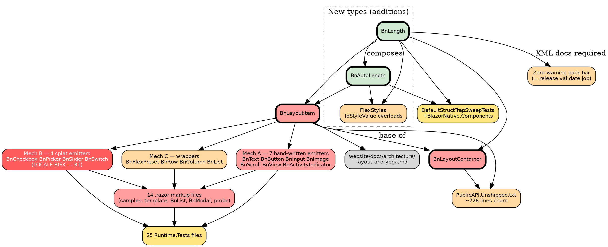

# Impact Analysis: Phase 13.1 — Type the lengths

**Design spec:** [`docs/superpowers/specs/2026-08-20-phase-13.1-design.md`](../superpowers/specs/2026-08-20-phase-13.1-design.md)
**Predecessor:** [Phase 13.0 conclusion](2026-08-19-phase-13.0-conclusion.md) — this analysis
assumes 13.0's bases are in place; every count below was taken on `main` at `f7aa1b7`.

## Summary

| Metric | Value |
|---|---|
| Date | 2026-08-20 |
| Refactor type | **Change Interface** (deep — every consumer adapts) |
| Targets | 8 |
| Directly affected files | 47 |
| Transitively affected files | 3 |
| Total affected files | 50 |
| Breaking changes | 33 |
| Risks identified | 7 |
| Risk level | **Medium** |

Medium rather than High: 50 files is inside the band, and the single high-severity risk (the
locale trap, R1) has a mechanical mitigation. What keeps it off Low is that the **acceptance test
is byte-identical frame tables on two platforms**, which no amount of .NET-side green proves.

## Refactor targets

| # | Target | Kind | Change |
|---|---|---|---|
| 1 | `BnLength`, `BnAutoLength`, `BnLengthUnit` | Addition | New public types in `BlazorNative.Components` |
| 2 | `BnLayoutItem` — 12 properties | Change Interface | `Margin`, `Basis`, `Width`, `Height` → `BnAutoLength?`; `MinWidth`, `MaxWidth`, `MinHeight`, `MaxHeight`, `Top`, `Right`, `Bottom`, `Left` → `BnLength?` |
| 3 | `BnLayoutContainer` — 2 properties | Change Interface | `Padding` `float?`→`BnLength?`; `Gap` `string?`→`BnLength?` |
| 4 | `EmitItemAttributes` / `ItemAttributes` (+ container twins) | Change Interface | Call `.ToStyleValue()`; the splat stores **strings, never structs** |
| 5 | `BnList<TItem>.Width` | Change Interface | → `BnLength?`. `Height` / `ItemHeight` stay `float` (spec §3.4) |
| 6 | `FlexStyles.ToStyleValue` | Extract/Add | Overloads for both new types, invariant culture |
| 7 | `DefaultStructTrapSweepTests.ApiAssemblies` | Update | Add `BlazorNative.Components` (spec §8) |
| 8 | `PublicAPI.Unshipped.txt` | Update | Baseline rewrite, read as an API review |

**Explicitly out of scope:** `Grow`, `Shrink`, `BackgroundColor`, `BnList.Height`/`ItemHeight`,
and everything under `src/BlazorNative.Jni/` or `templates/**/shell/`.

## The three emission mechanisms — and why only one is dangerous

13.0 left three distinct paths from a parameter to the wire. They are **not** equally exposed by
this refactor, and conflating them is the easiest way to get this phase wrong.

| Mech | How | Components | Exposure to typing |
|---|---|---|---|
| **A** | `EmitItemAttributes(b)` → `b.AddAttribute(seq, "width", …)` | `BnActivityIndicator`, `BnButton`, `BnImage`, `BnInput`, `BnScroll`, `BnText`, `BnView` (7) | **Explicit** — the call site formats: `Width.ToStyleValue()` |
| **B** | `@attributes="ItemAttributes"` → dictionary → **element** attributes | `BnCheckbox`, `BnPicker`, `BnSlider`, `BnSwitch` (4) | **DANGEROUS** — see R1. Values land on an element and are stringified by the renderer |
| **C** | `ForwardItemParameters` → `AddComponentParameter(seq, "Width", …)` | `BnFlexPreset` (→ `BnRow`, `BnColumn`), `BnList` | **Safe** — the value stays typed until it reaches a base that emits via A |

Mechanism C is safe precisely because it forwards to a *component parameter*, not an element
attribute: no stringification happens, so no culture is consulted. Mechanism B is the opposite,
and it is where R1 lives.

## Dependency graph

Legend: **red** = Breaking · **orange** = Update Required · **yellow** = Test Impact ·
**grey** = Cosmetic · **green** = new · bold border = target.

## Affected files

Counted by search over git-tracked files; `bin/` and `obj/` excluded.

| # | Area | Files | Classification | Change required | Complexity |
|---|---|---|---|---|---|
| 1 | `BnLayoutItem.cs` | 1 | **Breaking** | 12 property types; `EmitItemAttributes` formats; `ItemAttributes` stores strings; `ForwardItemParameters` unchanged in shape | Moderate |
| 2 | `BnLayoutContainer.cs` | 1 | **Breaking** | `Padding`, `Gap` types; container emit + splat | Moderate |
| 3 | Mech A emitters | 7 | **Breaking** | `.ToStyleValue()` at each `AddAttribute`; sequence bands unchanged | Trivial |
| 4 | Mech B emitters | 4 | **Breaking** | Nothing at the call site — the fix is in `ItemAttributes` (R1) | Trivial |
| 5 | Mech C wrappers | 4 | **Breaking** | `AddComponentParameter` value types change; `BnList.Width` typed | Moderate |
| 6 | `FlexStyles.cs` | 1 | Update Required | Two `ToStyleValue` overloads, invariant | Trivial |
| 7 | `.razor` markup | 14 | **Breaking** | 44 numeric literals compile unchanged; 1 `%` literal rewritten; `@`-bound expressions retyped | Moderate |
| 8 | `Runtime.Tests` | 25 | Test Impact | Assertions on typed values; new compile-failure, locale, and `default` pins | Moderate |
| 9 | `PublicAPI.Unshipped.txt` | 1 | Update Required | ~226 lines; read as an API review, not regenerated blindly | Moderate |
| 10 | `DefaultStructTrapSweepTests.cs` | 1 | Test Impact | Add `BlazorNative.Components` to `ApiAssemblies` | Trivial |
| 11 | `website/docs/architecture/layout-and-yoga.md` | 1 | Cosmetic | Prose describes lengths as strings | Trivial |
| 12 | XML doc comments on new types | — | Update Required | Required by the pack bar (R2) | Moderate |

**Not affected, verified:** `src/BlazorNative.Core`, `.Renderer`, `.Runtime`, `.Analyzers` matched
only on unrelated identifiers (`node.Left` in Roslyn code, `CameraCapturedWidth`, `TopFrame`).
`Renderer.Tests` and `Analyzers.Tests` likewise. `samples/ConsumerSmoke` sets **no** lengths.
`templates/**/shell/*.kt` match because they *parse* the grammar — untouched by design.

## Risk register

| # | Risk | Files | Severity | Mitigation |
|---|---|---|---|---|
| **R1** | **Culture-sensitive `ToString()` on a boxed struct reaches the wire.** `ItemAttributes` is `IReadOnlyDictionary<string, object?>` whose values land on **element** attributes and are stringified by the renderer. A boxed `BnLength` on a comma-decimal machine emits `1,5`; both shells then reject it as "not a number, a percentage or `auto`". Invisible on any English dev box. | `BnLayoutItem.cs`, `BnLayoutContainer.cs`, the 4 Mech-B components | **High** | Store the **formatted string** in the dictionary, never the struct. Pin: emit the surface under a comma-decimal culture and assert the wire text. This risk does not exist today — the phase creates it. |
| **R2** | **Zero-warning pack bar is the release's `validate` job.** New public types without complete XML docs raise CS1591 and fail `consumer-smoke.ps1` — the same gate that made `v0.9.0` an orphan tag. 13.0 also broke the *site* build with `<see cref>` to non-public members under `onBrokenAnchors: 'throw'`. | New type files | **High** | Full XML docs on every public member; **no `<see cref>` to protected/internal members** — use `<c>`. Verify with a clean pack **and** `cd website && npm run build`. |
| **R3** | **Frame tables move.** The refactor's correctness claim is byte-identical frames on both shells; a formatting difference (trailing `.0`, rounding) would be invisible in .NET tests and visible only on device. | All emitters | **High** | Frame tables are the acceptance test. `float.ToString(InvariantCulture)` must be preserved **exactly** — same call as today's `ToStyleValue(this float?)`, not a re-implementation. Both device lanes dispatched. |
| **R4** | **`default(BnAutoLength)` reads as `auto`, not unset.** Per the composition encoding, inner `null` == `auto`. A bare (non-nullable) field would silently mean "absorb free space" — on `Margin`, that re-centres the node. This is #178's shape. | New types, every parameter | **Medium** | Parameters are `BnLength?` / `BnAutoLength?` throughout (spec §3.3). Pin `default(…?) == null` for both. Extend the trap sweep to Components (target 7). |
| **R5** | **Baseline churn hides a real removal.** ~226 `PublicAPI` lines change; a genuinely removed member could ride along unnoticed. 13.0 hit the same shape at 292 lines. | `PublicAPI.Unshipped.txt` | **Medium** | Read the diff as an API review: every `*REMOVED*` must be matched by an added line of the same name. Pin member **names** so a vanishing name reds regardless of type. |
| **R6** | **Razor's `double` literal.** `Width="12.5"` compiles as `double`; `double`→`float` is narrowing, so without an implicit `double` operator every decimal literal fails CS1503. | New types, markup | **Medium** | The `double` operator is a required part of the design (spec §4.2), proven by probe. A pin compiles a decimal literal. |
| **R7** | **Scope creep into an analyzer.** The compile errors are correct but cryptic (`12px` → "syntax error, ',' expected"). The pull toward a friendly diagnostic is real. | — | **Low** | Out of scope (spec §9). The migration note carries the CS-code → cause table instead. |

**No dynamic-reference risk.** Layout parameters are never resolved by string name from .NET —
the only string-keyed path is `ItemAttributes`, whose keys are the wire vocabulary and are
generated from `src/wire-vocabulary.json` (#262), not hand-written. **No circular dependencies**
in the component graph. **No serialized state** carries these values. **External consumers exist**
(the packages are published), which is why the migration note is a deliverable rather than a
courtesy.

## Execution order

Ordered so the tree compiles at every checkpoint. Leaf-first: the new types have no dependents,
so they land before anything consumes them.

### Group 1 — The types, alone *(no dependents)*
- `BnLength.cs`, `BnAutoLength.cs`, `BnLengthUnit` — types, conversions (**including `double`**), invariant `ToStyleValue()`
- `FlexStyles.cs` — overloads
- Pins: parse/format round-trip, `default(…?) == null` (**R4**), invariant formatting under a comma-decimal culture (**R1**), decimal literal compiles (**R6**)
- **Checkpoint:** `dotnet test`, commit. *Nothing else has changed — the suite must be green and the frame tables untouched.*

### Group 2 — Trap sweep + baseline for the additions
- `DefaultStructTrapSweepTests.cs` — add `BlazorNative.Components`
- `PublicAPI.Unshipped.txt` — the new types only
- **Checkpoint:** `dotnet test`, commit

### Group 3 — `BnLayoutItem` + `BnLayoutContainer` **(ATOMIC)**
- 14 property types; all three emission mechanisms updated together
- **The splat must store formatted strings** (**R1**)
- Cannot be split: the bases and their emitters are one compilation unit's worth of truth
- **Checkpoint:** build only — markup has not been migrated yet and will not compile

### Group 4 — Mech A emitters (7) **(ATOMIC with Group 3 for compilation)**
- `.ToStyleValue()` at each `AddAttribute`; sequence bands unchanged
- **Checkpoint:** build

### Group 5 — Mech C wrappers (4)
- `BnFlexPreset`, `BnRow`, `BnColumn`; `BnList.Width` typed, `Height`/`ItemHeight` left alone
- **Checkpoint:** build

### Group 6 — Markup migration (14 `.razor` files)
- 44 numeric literals need no edit; 1 `%` literal → `@BnLength.Percent(50)`; `@`-bound expressions retyped
- **Checkpoint:** full `dotnet test` — **first point since Group 2 where the whole tree compiles**

### Group 7 — Tests, pins, baseline review
- Compile-failure pin (`12px`, `50%`, `auto`, `abc`, `100 px` all red)
- `PublicAPI.Unshipped.txt` read as an API review (**R5**)
- **Checkpoint:** full suite, commit

### Group 8 — Docs, migration note, device lanes
- XML docs verified by a clean pack **and** `npm run build` (**R2**)
- `layout-and-yoga.md` prose; migration note with the CS-code table
- **Dispatch `android-instrumented` and `ios`** — frame tables byte-identical (**R3**)
- **Checkpoint:** both lanes green with no frame-table file in the diff, then `complete-phase`

**Groups 3–5 leave the tree non-compiling** — deliberately. The bases and every emitter change
together, and markup cannot be migrated until the types are in place. That window is the phase's
riskiest stretch and is why Group 6's checkpoint is the first full-suite run after Group 2.

## Cross-cutting decisions

Recorded here rather than in long-term memory: no `longterm-memory` MCP tools are available in
this session and the project has no `.squad/decisions.md`, so `decision-tracker` degraded to
embedding them in the plan documents. These are the durable ones.

1. **Two length types, not four.** Negative-legality stays shell-side. `Width="-8"` still compiles.
2. **Nullable everywhere.** `BnLength?` / `BnAutoLength?`; `null` is unset, and `default` is `null`.
3. **`BnList<TItem>` stays allowlisted**, reason settled: its `Height` is the windowing divisor.
4. **No shell change, ever, in this phase.** A `.kt` or `.swift` file in the diff means the design was wrong.
5. **The splat carries strings, not structs** — the standing form of R1, and it outlives this phase.
